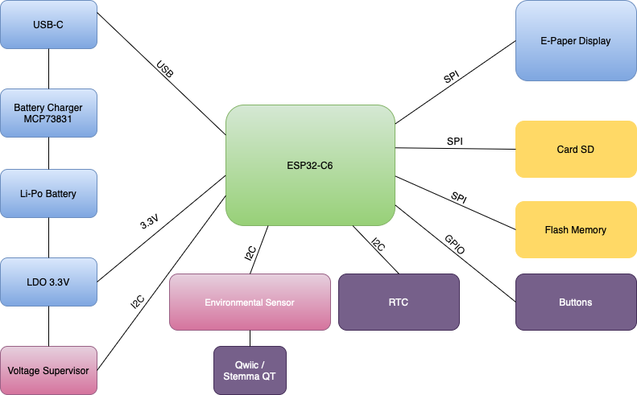
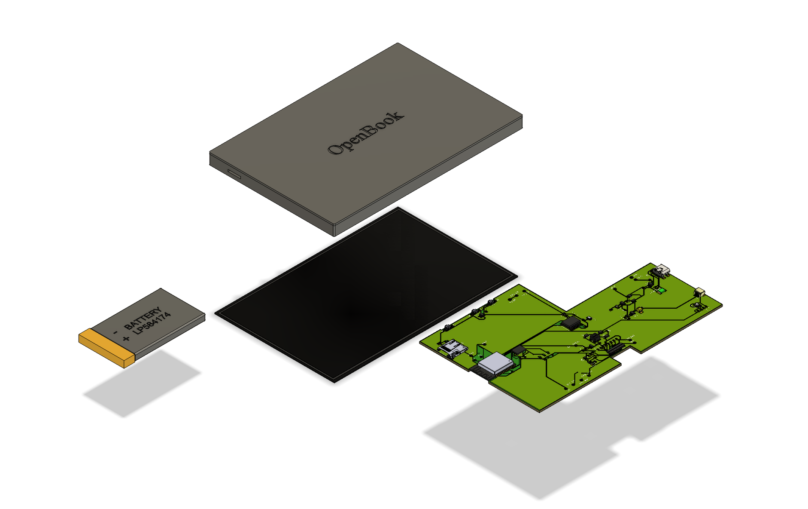

## © 2025 Gabriel-Claudiu TINTU

# OpenBook - E-Book Reader Project

## Table of Contents

1. [Block Diagram](#block-diagram)
2. [Bill of Materials (BOM)](#bill-of-materials-bom)
3. [Hardware Functionality and Components](#hardware-functionality-and-components)
   - [Main Controller](#main-controller)
   - [Display System](#display-system)
   - [Power Management](#power-management)
   - [Memory and Storage](#memory-and-storage)
   - [Sensors and Timing](#sensors-and-timing)
   - [Connectivity](#connectivity)
4. [ESP32-C6 Pin Usage](#esp32-c6-pin-usage)
5. [3D Representation](#3d-representation)

## Block Diagram

## Bill of Materials (BOM)
| Package                                      | Parts                                                                                             | Datasheet | Supplier  |
|----------------------------------------------|---------------------------------------------------------------------------------------------------|----------------|-----------------|
| ADAFRUIT_CHIP-LED0603                        | CHG_LED                                                                                           | [Link](https://eu.mouser.com/datasheet/2/216/AP1608SURCK-71562.pdf)      | [Link](https://eu.mouser.com/ProductDetail/Kingbright/AP1608SURCK?qs=VdjlWU%2FzoOEvYrd0H0exvQ%3D%3D)       |
| SJ                                           | SJ1                                                                                               | [Link](https://grabcad.com/library/solder-jumpers-1)      | [Link](https://grabcad.com/library/solder-jumpers-1)       |
| ESP32_WROVER_EAGLE-LTSPICE_R0402             | R1_PWRUSB, R1, R1_PINH1, R2-PINH, R2-PINH1, R5, R6, R7, R8, R9, R10, R_BOOT, R_CL1, R_RESET, R3, R1_PINH, R4, R_CHANGE, R_CAPACITOR, R2, R1_BAT, R2_BAT, R2_USB, R2_USB1                                                                                       | [Link](https://eu.mouser.com/datasheet/2/447/YAGEO_PYu_RC_Group_51_RoHS_L_12-3313492.pdf)      | [Link](https://eu.mouser.com/ProductDetail/YAGEO/RC0402FR-07100KL?qs=mnq%2FyloZIXzTlUn7JAHSWg%3D%3D)       |
| ESP32_WROVER_EAGLE-LTSPICE_C0402             | C1, C2, C4_USB, C6, C8, C9, C10, C_DELAY, EPD_C5, EPD_C1, EPD_C2, EPD_C6, EPD_C7, EPD_C8, EPD_C9, EPD_C10, EPD_C11, EPD_C12, C7, C5, C4, C1_BAT, C1_BAT1, C1_BAT2, C2_BAT, C5_USB                                                           | [Link](https://eu.mouser.com/datasheet/2/447/upy_gphc_x5r_4v_to_50v-3461255.pdf)      | [Link](https://eu.mouser.com/ProductDetail/YAGEO/CC0402MRX5R5BB106?qs=zEY9bCHj09eCmUJdZuS5Lg%3D%3D)       |
| RCL_CT3528                                   | C3                                                                                                 | [Link](https://eu.mouser.com/datasheet/2/40/TAJ-3165264.pdf)      | [Link](https://eu.mouser.com/ProductDetail/KYOCERA-AVX/TAJB475K025RNJ?qs=mgX5NEyWO4Sl7CIvkz4Jiw%3D%3D)       |
| 112ATAARR03ATTEND                            | J4                                                                                                 | [Link](https://store.comet.bg/download-file.php?id=27596)      | [Link](https://store.comet.srl.ro/Catalogue/Product/43497/)       |
| ESP32_WROVER_SPARKFUN-DISCRETESEMI_SOT23-3    | Q1, Q2                                                                                             | [Link](https://www.diodes.com/assets/Datasheets/DMG2305UX.pdf)      | [Link](https://eu.mouser.com/ProductDetail/Diodes-Incorporated/DMG2305UX-7?qs=L1DZKBg7t5F%2FNBHrjfxC%252Bg%3D%3D)       |
| IND_4828-WE-TPC_WRE                         | L1                                                                                                 | [Link](https://www.we-online.com/components/products/datasheet/744043680.pdf)      | [Link](https://eu.mouser.com/ProductDetail/Wurth-Elektronik/744043680?qs=PGXP4M47uW6VkZq%252BkzjrHA%3D%3D)       |
| SOT95P280X125-5N                             | IC1                                                                                                | [Link](https://fscdn.rohm.com/en/products/databook/datasheet/ic/power/voltage_detector/bd52xxg-e.pdf)      | [Link](https://eu.mouser.com/ProductDetail/ROHM-Semiconductor/BD5229G-TR?qs=4kLU8WoGk0vvnhrrYwdszw%3D%3D)       |
| MYBUTTON                                     | BOOT_BUTTON, CHANGE_BUTTON, RESET_BUTTON                                                         | [Link](https://www3.panasonic.biz/ac/e_download/control/switch/light-touch/catalog/sw_lt_eng_3529s_side.pdf?f_cd=402906)      | [Link](https://eu.mouser.com/ProductDetail/Panasonic/EVQ-P7L01P?qs=rJ%252BziJWpyszWhhNszc02jQ%3D%3D)       |
| CAPCP3225X100N                               | C10_SUPERCAP                                                                                        | [Link](https://eu.mouser.com/datasheet/2/360/Seiko_Instruments_MicroBattery_E_20230330_2024Jan_-3561061.pdf)      | [Link](https://eu.mouser.com/ProductDetail/Seiko-Semiconductors/CPH3225A?qs=3etwrb1wR%252BhUOph6lAO7eg%3D%3D)       |
| SOIC127P1032X265-16N                         | U3                                                                                                 | [Link](https://eu.mouser.com/datasheet/2/609/DS3231-3421123.pdf)      | [Link](https://eu.mouser.com/ProductDetail/Analog-Devices-Maxim-Integrated/DS3231SN?qs=1eQvB6Dk1vhUlr8%2FOrV0Fw%3D%3D)       |
| XCVR_ESP32-C6-WROOM-1-N8                    | U2                                                                                                 | [Link](https://eu.mouser.com/datasheet/2/891/Espressif_ESP32_C6_WROOM_1__Datasheet_V0_1_PRELIMI-3239987.pdf)      | [Link](https://eu.mouser.com/ProductDetail/Espressif-Systems/ESP32-C6-WROOM-1-N8?qs=8Wlm6%252BaMh8ST02Gmwp74cw%3D%3D)       |
| ESP32C6_VARISTOR_CT/CN1812                  | PFMF.050.1                                                                                        | [Link](https://eu.mouser.com/datasheet/2/358/typ_PFMF-1275918.pdf)      | [Link](https://eu.mouser.com/ProductDetail/Schurter/PFMF.050.2?qs=1auRipcfynCums5v1iucSA%3D%3D)       |
| ESP32_WROVER_AVX---SD0805S020S1R0_AVX_SD0805S020S1R0_0 | D2, D7                                                                                             | [Link](https://eu.mouser.com/datasheet/2/40/schottky-3165252.pdf)      | [Link](https://eu.mouser.com/ProductDetail/KYOCERA-AVX/SD0805S020S1R0?qs=jCA%252BPfw4LHbpkAoSnwrdjw%3D%3D)       |
| ESP32_WROVER_BME680_PSON80P300X300X100-8N    | SENSOR2                                                                                           | [Link](https://www.bosch-sensortec.com/media/boschsensortec/downloads/datasheets/bst-bme680-ds001.pdf)      | [Link](https://store.comet.srl.ro/Catalogue/Product/50164/)       |
| ESP32_WROVER_SPARKFUN-IC-POWER_SOT23-5       | U0                                                                                                 | [Link](https://eu.mouser.com/datasheet/2/268/MCP73831_Family_Data_Sheet_DS20001984H-3441711.pdf)      | [Link](https://eu.mouser.com/ProductDetail/Microchip-Technology/MCP73831T-4ADI-OT?qs=hH%252BOa0VZEiBTiqxSV9eepQ%3D%3D)       |
| FH34SRJ24S05SH99                             | J1                                                                                                 | [Link](https://eu.mouser.com/datasheet/2/760/xc6220-3371556.pdf)      | [Link](https://eu.mouser.com/ProductDetail/Torex-Semiconductor/XC6220A331MR-G?qs=AsjdqWjXhJ8ZSWznL1J0gg%3D%3D)       |
| SON50P200X200X80-9N                          | U4                                                                                                 | [Link](https://eu.mouser.com/datasheet/2/609/MAX17048_MAX17049-3469099.pdf)      | [Link](https://eu.mouser.com/ProductDetail/Analog-Devices-Maxim-Integrated/MAX17048G%2bT10?qs=D7PJwyCwLAoGnnn8jEPRBQ%3D%3D)       |
| SOD3716X135N                                 | D3, D4, D5                                                                                         | [Link](https://eu.mouser.com/datasheet/2/40/schottky-3165252.pdf)      | [Link](https://eu.mouser.com/ProductDetail/KYOCERA-AVX/SD0805S020S1R0?qs=jCA%252BPfw4LHbpkAoSnwrdjw%3D%3D)       |
| DIOC1608X36N                                 | D6, D8, D9, D10, D11, D12                                                                           | [Link](https://www.littelfuse.com/assetdocs/pulseguard-esd-suppressors-pgb1-datasheet?assetguid=8a337998-d54d-466b-be4e-dc5bcd1f9321)      | [Link](https://eu.mouser.com/ProductDetail/Littelfuse/PGB1010603MR?qs=gu7KAQ731URLg4GSnNNN7Q%3D%3D)       |
| JST04_1MM_RA                                 | J3                                                                                                 | [Link](https://eu.mouser.com/datasheet/2/813/Qwiic_Connector_Datasheet-1223982.pdf)      | [Link](https://eu.mouser.com/ProductDetail/SparkFun/PRT-14417?qs=wd5RIQLrsJhgdz%2FpmZ%2F3GQ%3D%3D)       |
| SAMACSYS_PARTS_USB4110GFA                    | J2                                                                                                 | [Link](https://eu.mouser.com/datasheet/2/837/GCT_USB4110_Product_Drawing___20k_cycles-3455479.pdf)      | [Link](https://eu.mouser.com/ProductDetail/GCT/USB4110-GF-A?qs=KUoIvG%2F9IlYiZvIXQjyJeA%3D%3D)       |
| SOT65P210X110-3N                             | Q3                                                                                                 | [Link](https://www.vishay.com/doc?63399)      | [Link](https://eu.mouser.com/ProductDetail/Vishay-Semiconductors/SI1308EDL-T1-GE3?qs=bX1%252BNvsK%2FBramh9tgpOaEw%3D%3D)       |
| SOT95P280X145-6N                             | D1                                                                                                 | [Link](https://eu.mouser.com/datasheet/2/389/usblc6_2sc6y-1852505.pdf)      | [Link](https://eu.mouser.com/ProductDetail/STMicroelectronics/USBLC6-2SC6Y?qs=gNDSiZmRJS%2FOgDexvXkdow%3D%3D)       |
| SON127P600X800X80-9N                         | U1                                                                                                 | [Link](https://eu.mouser.com/datasheet/2/949/Winbond_W25Q512JV_Datasheet-3240039.pdf)      | [Link](https://eu.mouser.com/ProductDetail/Winbond/W25Q512JVEIQ?qs=l7cgNqFNU1jw6svr3at6tA%3D%3D)       |
| SOT95P280X120-5N                             | IC4                                                                                                | [Link](https://eu.mouser.com/datasheet/2/760/xc6220-3371556.pdf)      | [Link](https://eu.mouser.com/ProductDetail/Torex-Semiconductor/XC6220A331MR-G?qs=AsjdqWjXhJ8ZSWznL1J0gg%3D%3D)       |

## Hardware Functionality and Components

### Main Controller

* ESP32-C6-WROOM-1-N8: The core microcontroller module that manages all device functions

### Display System

* E-Paper Display: Connected via a 24-pin FH34SRJ-24S-0.5SH connector (J1)
* E-Paper Drive Circuit: Custom circuitry for driving the e-paper display
* Display Type Selector: Allows for configuration of different e-paper display types

### Power Management

* LDO Voltage Regulator (XC6220A331MR-G): Provides regulated 3.3V power supply for the system
* Battery Charge Controller (MCP73831): Manages charging of the Li-Po battery
* Battery Charge Level Monitor (MAX17048G+T10): Monitors battery charge level and status
* USB C Connector: For power input and data communication
* ESD Protection (USBLC6-2SC6Y): Protects USB data lines from electrostatic discharge

### Memory and Storage

* External NOR Flash (W25Q512JVEIQ): 64MB flash memory for data storage
* SD Card Slot: For expandable storage

### Sensors and Timing

* Environmental Sensor (BME688): Measures temperature, humidity, pressure, and gas resistance
* RTC Module (DS3231SN): Real-time clock for accurate timekeeping

### Connectivity

* Qwiic/Stemma QT Connector: For I2C-based expansion modules
* USB-C: For data communication and power

## ESP32-C6 Pin Usage

| **Pin** | **Function** | **Component** | **Purpose** |
|-----|----------|-----------|---------|
| EN  | RESET | Reset button | System reset input |
| IO0 | INT_RTC | RTC | RTC interrupt for timing events |
| IO1 | 32KHZ | RTC | 32kHz clock signal from RTC |
| IO2 | MISO | SPI Bus | Data input from SPI peripherals |
| IO3 | EPD_BUSY | E-Paper Display | Monitor display ready status |
| IO4 | SS_SD | SD Card | SD card chip select |
| IO5 | EPD_DC | E-Paper Display | Display data/command selection |
| IO6 | SCK | SPI Bus | SPI clock signal |
| IO7 | MOSI | SPI Bus | Data output to SPI peripherals |
| IO8 | GPIO8 | General Purpose | Auxiliary functions |
| IO9 | IO/BOOT | Boot button | Boot mode selection |
| IO10 | EPD_CS | E-Paper Display | Display chip select |
| IO11 | FLASH_CS | External NOR Flash | Flash memory chip select |
| IO12 | USB_D- | USB Interface | USB data negative line |
| IO13 | USB_D+ | USB Interface | USB data positive line |
| IO15 | IO/CHANGE | Change button | Status change detection |
| IO16/TXD0 | TX | Serial Debug | UART transmit |
| IO17/RXD0 | RX | Serial Debug | UART receive |
| IO18 | RTC_RST | RTC | RTC reset control |
| IO19 | I2C_PW | I2C Bus | I2C devices power control |
| IO20 | EPD_3V3_C | E-Paper Display | Display power control |
| IO21 | SDA | I2C Bus | I2C data line |
| IO22 | SCL | I2C Bus | I2C clock line |
| IO23 | EPD_RST | E-Paper Display | Display reset control |

## 3D Representation

